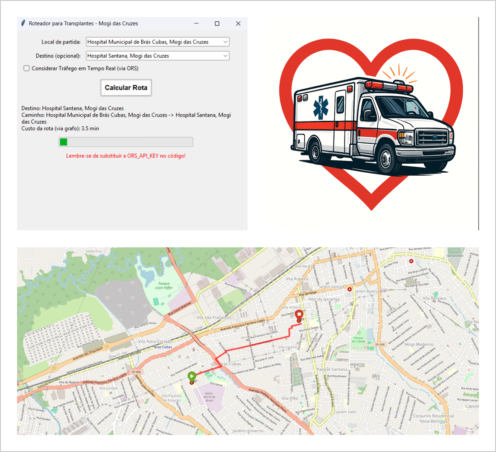
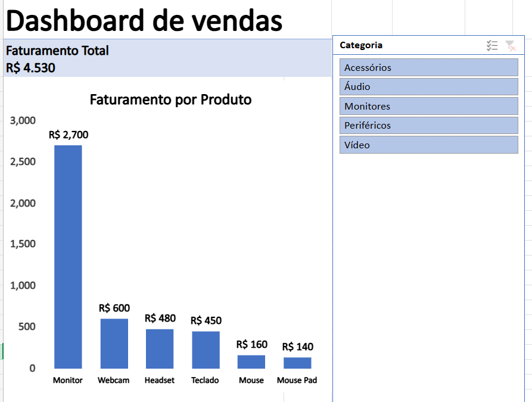

<h2 align="center">Olá, eu sou o Caio 🍀</h2>

Estudante de Análise e Desenvolvimento de Sistemas, com foco em dados.

Tenho experiência com projetos práticos envolvendo análise de dados, dashboards e manipulação de dados reais.

---

## 🚀 Projetos em destaque

### 🚑 Rota Vida – Roteador Inteligente para Transporte de Órgãos

Sistema desenvolvido em Python que calcula rotas otimizadas entre hospitais utilizando algoritmos de grafos e integração com mapas reais.

🔗 [Ver projeto](https://github.com/Caio-Moura/Projeto_Teoria_Grafos)

 

### 📊 Dashboard de Vendas

Análise de dados com construção de dashboard interativo para visualização de métricas como faturamento, média e desempenho de produtos.

🔗 [Ver projeto](https://github.com/Caio-Moura/excel-analise-vendas)

---

## 🛠 Tecnologias

### 📊 Dados
- Python
- Excel
- Pandas

### 💻 Desenvolvimento
- HTML
- CSS
- JavaScript

---

## 🎯 Objetivo

Buscando minha primeira oportunidade na área de dados, com foco em análise e resolução de problemas reais.

---

<picture>
  <source media="(prefers-color-scheme: dark)" srcset="https://raw.githubusercontent.com/abozanona/abozanona/output/pacman-contribution-graph-dark.svg">
  <source media="(prefers-color-scheme: light)" srcset="https://raw.githubusercontent.com/abozanona/abozanona/output/pacman-contribution-graph.svg">
  
</picture>

---

## 📫 Contato

  
  
  

